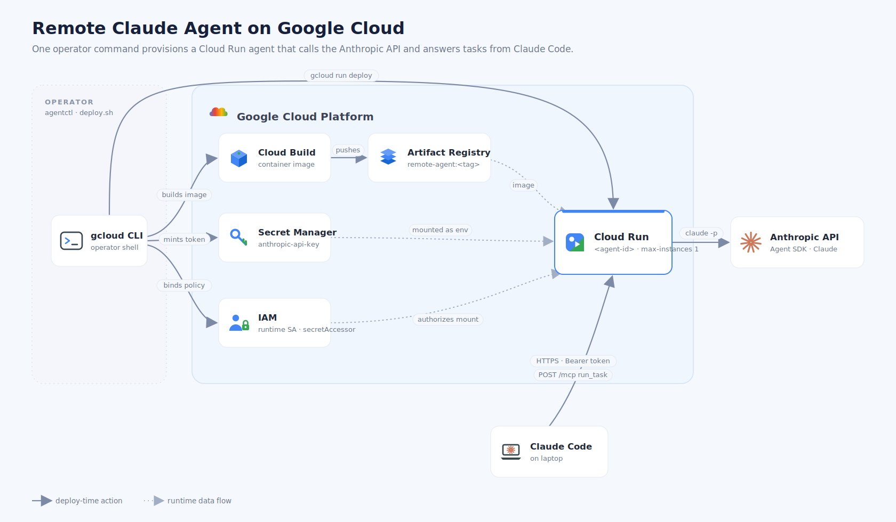

# sk8 🛹


A minimal MCP server that exposes a **remote Claude Code agent** over HTTP.
Claude Code on your laptop can call its one tool, `run_task`, to delegate a
complete, self-contained task to a Claude Code instance running on this machine.

The tool runs `claude` headless here and returns the final text answer.
It is **synchronous and blocking** — no queue, no streaming, no status polling.

**`server_sdk.py`** — drives the same agent loop through the **Claude Agent
SDK** (`claude-agent-sdk`), giving a typed async message stream and structured
permission control. **This is what the container image runs**, because
`ClaudeAgentOptions` applies per-agent profile customization (tools, MCP,
system prompt) natively. 

Agents can be **customized per profile** — extra Python packages, bundled Claude
Code skills, and a tool/MCP/system-prompt spec baked into the image at build
time.

## GCP project setup (one-time)

The `sk8` CLI drives `gcloud` to provision agents on Cloud Run, so a GCP project
has to be prepared once before `sk8 create` will work. Run these once per
project (not per agent):

```bash
# 1. Install the gcloud SDK, then authenticate.
gcloud auth login

# 2. Select the project sk8 should deploy into (must have billing enabled).
gcloud config set project YOUR_PROJECT_ID

# 3. Enable the APIs sk8 uses (Cloud Run, Secret Manager, Artifact Registry, Cloud Build).
gcloud services enable \
  run.googleapis.com \
  secretmanager.googleapis.com \
  artifactregistry.googleapis.com \
  cloudbuild.googleapis.com

# 4. Create the Docker repo sk8 pushes the agent image to.
#    The name "agents" and location must match sk8's defaults
#    (--repo agents, --region us-central1); override both flags if you change them.
gcloud artifacts repositories create agents \
  --repository-format=docker --location=us-central1

# 5. Store the shared Claude credential the agents run under, as the
#    "anthropic-api-key" secret (sk8 mounts it into every agent).
printf '%s' "$ANTHROPIC_API_KEY" | \
  gcloud secrets create anthropic-api-key --data-file=-
```

With that in place, `sk8 create <id> --build` builds the image (first time) and
deploys the agent. You can preview every `gcloud` command without running it via
`sk8 create <id> --dry-run`.

## 🛹 CLI

`sk8` is the command-line tool for managing agents — scriptable for both humans
and agents alike. It exposes the full agent lifecycle and emits JSON so a running
agent can spawn and register sub-agents. Install it as a console script to run
`sk8 <cmd>` from anywhere, or run it in place with `python sk8.py <cmd>`:

```bash
uv tool install .                  # install the `sk8` command from this repo
uv tool install --reinstall .      # reinstall after pulling/editing the code
uv tool uninstall sk8              # remove it
# (or use pipx/pip: `pipx install .` / `pipx reinstall sk8`)
```

Then drive the agent lifecycle:

```bash
sk8 create iris --build     # build image (first time) + provision
sk8 create iris             # subsequent agents reuse the image
sk8 create iris --profile ./profiles/data-analyst --build  # custom deps/skills/tools
sk8 create iris --json      # for agents: parse back {url, token, mcp_add_command}
sk8 create iris --dry-run   # preview the gcloud commands offline
sk8 list                    # list deployed agents in the region
sk8 delete iris --yes       # tear down the service + its token secret
sk8 suggest 5               # propose adjective-noun names
```

`create` prints the end-user's `claude mcp add` line (with `--json`, in the
`mcp_add_command` field). Re-running `create` with an existing id rotates its
token and redeploys.

## Verify

```bash
claude mcp list        # sk8 should show as connected
```

Then in a Claude Code session on your laptop:

> Use the sk8 run_task tool with prompt:
> "list the files in the current directory and summarize them"

The remote agent runs the task in its `cwd` and returns the final answer.

## Cloud deployment (Cloud Run, App Runner, Fly, …)

The GCP services (Cloud Build, Artifact Registry, Secret Manager, IAM, Cloud
Run) and the agent lifecycle — image build → token mint → a `run_task` call
triggering Cloud Run:




## Limitations

- **Synchronous only** — `run_task` blocks until the remote agent finishes (up
  to a 600s timeout). No streaming, no progress, no status to poll.
- **One task at a time** — there's no queue or concurrency management; fire tasks
  serially.
- **Arbitrary code execution** — `claude` can do anything the host user can. 
  Treat reaching this endpoint as equivalent to a shell on the box.
- **Stateless across calls** — each `run_task` is a fresh headless `claude`
  invocation with no memory of previous tasks. Put all needed context in the prompt.
